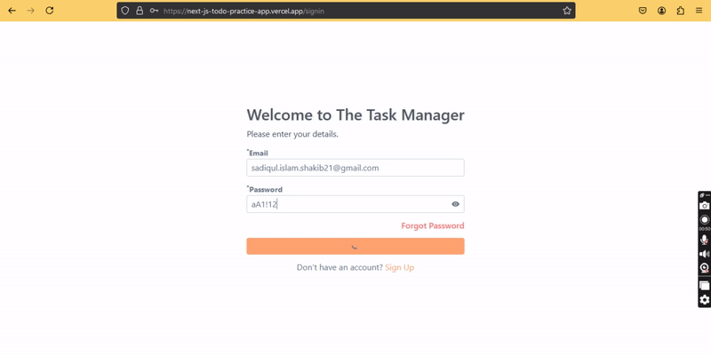

<!-- PROFILE HEADER -->
<h1 align="center">👋 Hey there, good people! Welcome to my GitHub space 🚀</h1>

<h3 align="center">
  I’m passionate about building innovative, user-focused projects and always exploring new ways to learn, create, and solve real-world problems.
</h3>

  

---

## 🛠 Tech & Tools I Work With

  
**Languages & Core**
 

**Frontend**
 

**Backend & Database**
 

**Version Control & Tools**
 

---

## 🏆 GitHub Achievements

  

---

## 📚 Currently Exploring
- 🌱 Deep diving into **Web Tools** & **OOP languages**
- 🛠 Building small yet impactful projects
- 📫 Reach me at: **sadiqul.islam.shakib21@gmail.com**

---

## 🌐 Connect With Me

  
  

---

## 🎓 Undergraduate Projects

| Project | Demo |
|---------|------|
| **[👉 Java Course: Cricket Score Management System](https://github.com/ByteCrister/NEUB-Projects-From-_22_)** |  |
| **[👉 Pong Game](https://github.com/ByteCrister/PONG-Game)** |  |
| **[👉 Database Project: Inventory Management](https://github.com/ByteCrister/Database-Project--2-2)** |  |
| **[👉 First Next.js App: Basic Todos (full setup)](https://github.com/ByteCrister/Next.js-todo-practice-app)** |  |
| **[👉 Note Task (Next.js, TypeScript)](https://github.com/ByteCrister/Smart-Note-Next.js-TypeScript-Redux-Mongoose.git)** |  |

---

## 📊 GitHub Stats

  

  

  

---

  💡 *Thanks for stopping by — keep building, keep exploring!* ✨

