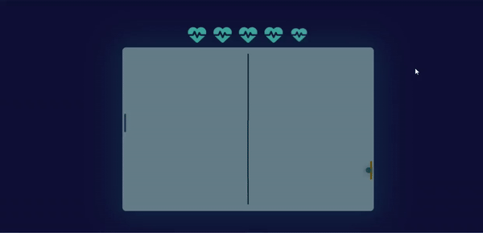

<h1 align="center">👋 Hi, I'm Sadiqul Islam Shakib</h1>
<h3 align="center">I’m always on the lookout for new learning opportunities and thrive on building innovative projects. I’m passionate about expanding my knowledge and applying it to create practical solutions. If you’re into exploring new technologies or working on exciting projects, let’s connect!</h3>

   

 

 

  
 

- 🌱 I’m currently learning **Web Tools, Object-Oriented Programming languages. Building small projects.**
- 📫 How to reach me: **sadiqul.islam.shakib21@gmail.com**

<h3 align="left">Connect with me:</h3>

  
  

 
 

<h3 align="left">Have experience with:</h3>

   

### Projects while I'm an undergraduate:

| Project & Repository                                            | Gif                                                                                                         |
|-----------------------------------------------------------------|-------------------------------------------------------------------------------------------------------------|
| **[👉Java Course: Cricket Score Management System](https://github.com/ByteCrister/NEUB-Projects-From-_22_)** |  |

| **[👉Pong Game](https://github.com/ByteCrister/PONG-Game)** |  |

| **[👉Database Project: Inventory Management](https://github.com/ByteCrister/Database-Project--2-2)** |  |

 **[👉Java Course: Cricket Score Management System](https://github.com/ByteCrister/NEUB-Projects-From-_22_)**  
  
  

  ---

  **[👉Pong Game](https://github.com/ByteCrister/PONG-Game)**  
  

  ---

 **[👉Database Project: Inventory Management](https://github.com/ByteCrister/Database-Project--2-2)**  
  

  ---

  

  

  

